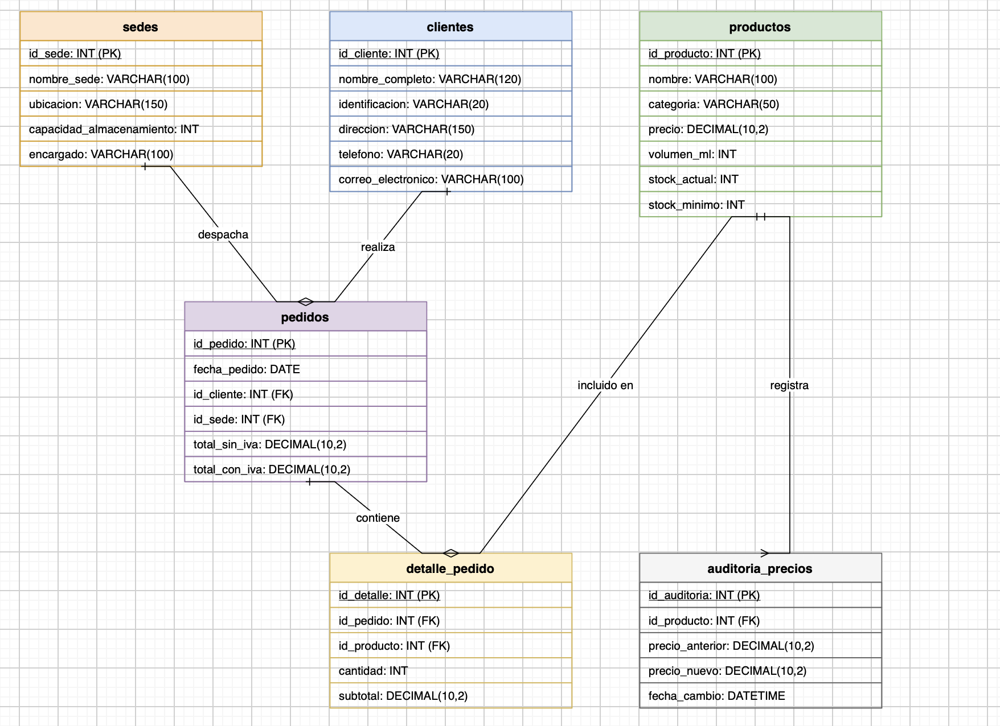

# distribuidora_gaseosas_sql_daniel_aguilar

# Gaseosas del Valle S.A. - Base de datos

## Descripcion del proyecto
- Gaseosas del Valle es una distribuidora de bebidas en Giron.
- Antes manejaban todo en hojas de calculo y eso generaba errores.
- Este proyecto crea una base de datos en MySQL para productos, clientes, sedes y pedidos.
- Incluye funciones, triggers, vistas y consultas para apoyar las decisiones del negocio.

## Archivos entregados
- database.sql crea las tablas y las relaciones entre ellas.
- functions.sql crea las funciones del proyecto.
- triggers.sql crea los triggers del proyecto.
- views_and_queries.sql crea las vistas y las consultas.
- Los scripts se deben ejecutar en ese mismo orden.

## Modelo entidad relacion
- Un cliente puede tener muchos pedidos.
- Una sede puede despachar muchos pedidos.
- Un pedido puede tener muchos productos y un producto puede estar en muchos pedidos.
- Esa relacion entre pedidos y productos se resuelve con la tabla detalle_pedido.
- Un producto puede tener muchos registros de auditoria de precio.
- Este mismo modelo se puede dibujar en diagram.net o Lucidchart.

## Funciones
- fn_calcular_total_con_iva recibe un pedido y devuelve su total con el 19% de IVA.
- fn_validar_stock recibe un producto y una cantidad, y dice si hay stock suficiente.

## Triggers
- tr_actualizar_stock descuenta el stock cuando se agrega un producto a un pedido.
- tr_auditar_cambio_precio guarda un registro cada vez que cambia el precio de un producto.
- tr_validar_stock_antes_pedido evita registrar un pedido si no hay stock suficiente.

## Vistas
- vista_resumen_pedidos_por_sede muestra el total de pedidos y ventas de cada sede.
- vista_productos_bajo_stock muestra los productos que ya llegaron a su stock minimo.
- vista_clientes_activos muestra los clientes que ya tienen al menos un pedido.

## Consultas incluidas
- Consulta de productos con stock por debajo del minimo.
- Consulta de pedidos realizados entre dos fechas.
- Consulta de los productos mas vendidos.
- Consulta de clientes con su cantidad de pedidos.
- Consulta de clientes por nombre parcial.
- Consulta de productos de ciertas categorias.
- Consulta del cliente con mas pedidos.
- Consulta de pedidos y totales agrupados por sede.
- Todas las consultas ya fueron probadas en un servidor real y funcionan.

## Recomendaciones para la expansion futura
- Agregar una tabla de empleados para saber quien registra cada pedido.
- Agregar una tabla de metodos de pago y facturacion.
- Crear mas indices cuando el negocio crezca, para mantener las consultas rapidas.
- Conservar el historial de auditoria aunque se elimine un producto.
- Usar procedimientos almacenados para reportes con varios pasos.
- Definir copias de seguridad periodicas de la base de datos.